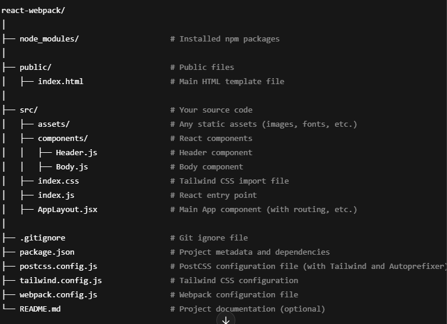

# React with webpack bundler

- created react-webpack folder on my desktop and opened in VS Code
- ctrl and tild (~) to open the terminal

### Installed the below packages to get react and webpack

```js
npm init
npm i react react-dom
npm install --save-dev webpack webpack-cli webpack-dev-server
npm install --save-dev @babel/core @babel/preset-env @babel/preset-react babel-loader
npm install --save-dev html-webpack-plugin

```

### Folder structure



- updated the webpack.config.js file with all the entry points, babel config.
- added .bablerc file at root level

### Added TailwindCSS

```js
npm install tailwindcss@npm:@tailwindcss/postcss7-compat postcss@^7 autoprefixer@^9 --save-dev
Added below files at root level:
    postcss.config.js:
    tailwind.config.js:
Added index.css inder src/ then imported in index.js
```

### Added routings

```js
npm install react-router-dom
used: <BrowserRouter> </BrowserRouter> in AppLayout
```

### Created mfe1 folder - About : Microfrontend

**_Installed the below packages to get react and webpack_**

```js
npm init
npm i react react-dom
npm install --save-dev webpack webpack-cli webpack-dev-server
npm install --save-dev @babel/core @babel/preset-env @babel/preset-react babel-loader
npm install --save-dev html-webpack-plugin
Added .babelrc file into root folder.
```

### Added webpack.config.js in mfe1

- Added all required configuration and exposed the "About" component which can be imported in Host app using ModuleFederationPlugin:

  - which takes an object with few parameter (name, filename, exposes, remotes), mainly used "exposes"

- Also, you can import other exposed components if needed

### Updated webpack.config.js in host (react-webpack)

ModuleFederationPlugin:

- which takes an object with few parameter (name, filename, exposes, remotes), mainly used "remotes"

### Restart the app if you update webpack.config.js file
